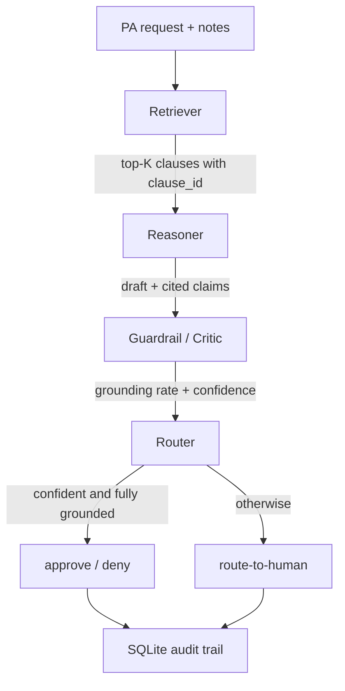

# Architecture

CareGuard is a LangGraph state machine of four single-purpose agents. The design
goal is inspectability: each node reads and writes a typed shared state
(`careguard/state.py`), so any decision can be traced end to end.

## Flow

1. **Retriever** builds a query from the requested service + clinical notes and
   pulls the top-K policy clauses from the vector store. Each clause carries a
   stable `clause_id` used for citation. Retrieval is vector similarity, not an
   LLM call.
2. **Reasoner** evaluates the case against those clauses and drafts a decision,
   a rationale, and a list of claims — each claim citing a `clause_id`. Prompt
   text lives in `config/prompts/reasoner.md`.
3. **Guardrail** checks that every cited clause exists in the retrieved set and
   supports its claim, sets a grounding rate, and produces a confidence score.
   Confidence is `min(grounding_rate, llm_confidence)` so one unverifiable claim
   caps how sure the system may be.
4. **Router** auto-resolves only when confidence clears the threshold, every
   claim is grounded, and the draft is approve or deny; otherwise it escalates.

## Why a graph, not one prompt

Single prompts hide their reasoning and are hard to test. Splitting the work
lets each step be unit-tested in isolation and makes the guardrail an explicit,
separate check rather than something the same model grades about itself.

## Swap points

- Vector store: `retrieval/vector_store.py` is a numpy cosine index with the same
  add/query/save/load interface as FAISS or Chroma, so either can replace it later.
- LLM: `mock` (deterministic, no key — used in tests/CI), `openai`, or `ollama`.
  Agents call `LLMClient`; they do not branch on provider.
- Ingest: PySpark when installed, otherwise a Python fallback over the same
  parse → clean → chunk functions.
- DB: SQLite by default; `storage/db.py` is the only file to change for Postgres.

## Eval loop

`python -m careguard.eval` runs the labeled set through the graph, scores
grounding / hallucination / accuracy / escalation / latency, asks the LLM-as-judge
for a second opinion, and writes `data/eval_report.json` plus an HTML report.
CI re-runs a grounding-floor test on every push so a prompt change cannot
silently degrade citation quality.
